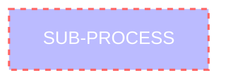
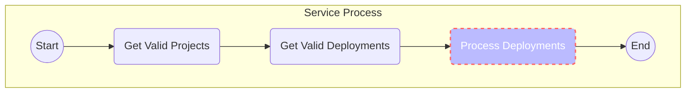
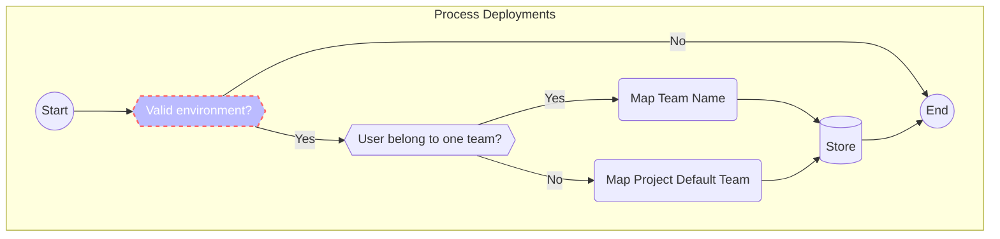
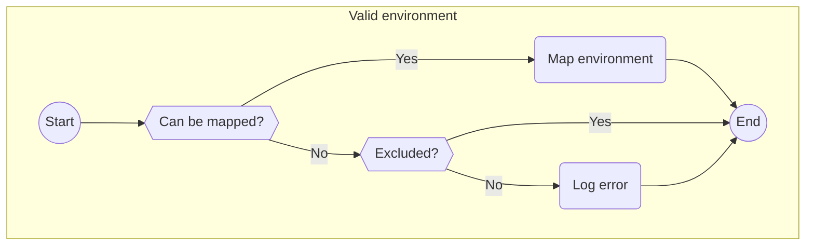

# Introduction 
DevOps doesn�t fully work without monitoring metrics. And software development doesn�t work if you don�t deploy code. Together, these two things combine into the key deployment frequency metric. You can better understand your team's performance by quantifying and tracking a metric like deployment frequency. Is your team deploying efficiently? Are the principles of DevOps being achieved with your team�s deployment schedule?


## Local development
### Start DB container
```
    docker run -e "ACCEPT_EULA=Y" -e "MSSQL_SA_PASSWORD=616969AE-4F8B-4C55-BFBB-327C8DF4DFEF" `
        -p 1433:1433 --name sql1 --hostname sql1 `
        -d `
        --restart unless-stopped `
        mcr.microsoft.com/mssql/server:2022-latest
```


## Install Grafana
```
docker run -d -p 3000:3000 --name=grafana --restart unless-stopped `
grafana/grafana-enterprise
```


# IT-Processes
The application is devided in to IT processes. Below you can read about them and get an understanding of what the application is doing.

Some processes are defined in sub processes. You can identity if a subprocess is documented by looking at it style. If it looks like the one below, a sub process is exits for the activity, click on it to jump to the location in the document.



## Overrall application process

### Valid projects
Non Archived

### Valid Deployments
Succeeded

## Process Deployments


## Valid environment mapping


